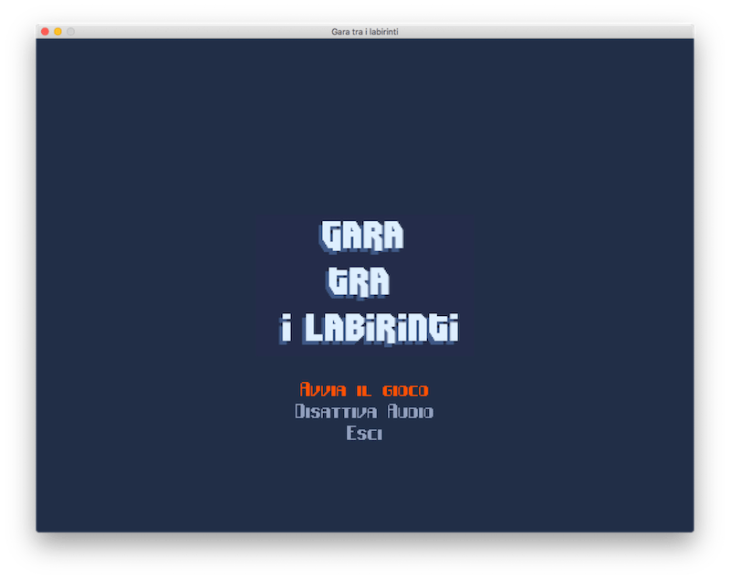
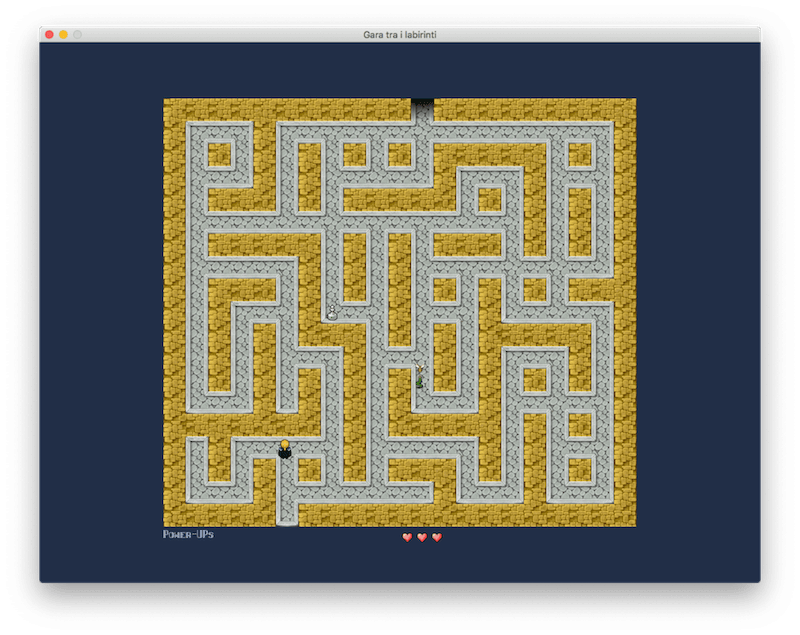
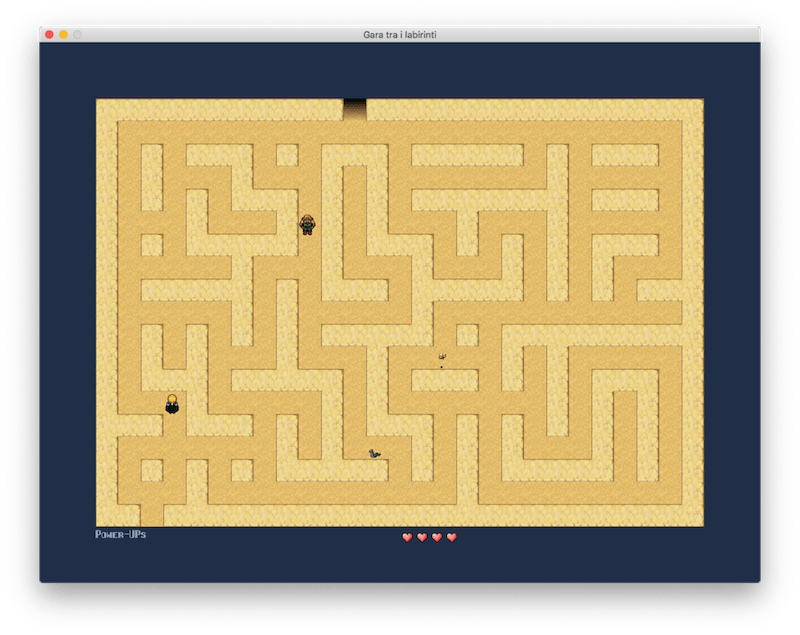

## Escape the maze
Small 2d game I developed some years ago as final project for my university course of Algorithms and Data Structures.

Comments are in italian and the code is not bug-free.

### Requirements
- `CMake 2.8` or older
- `Allegro 5.0` or older (https://liballeg.org)
- `Dumb 0.9.3` (optional, to add sound effects, http://dumb.sourceforge.net)
- Any c99 compiler

### Compiling
```
cmake .
make
```

### Screenshots



